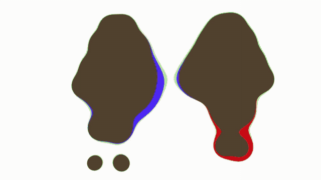

# Blob Mirror

Title: Blob Mirror

Date: 2024

Mediums: computer, camera, custom software (written in JavaScript and GLSL)

Dimensions: variable

Links: [video demo](https://www.instagram.com/p/C679cJRsmHr/?img_index=2)

**_Blob Mirror_** is an interactive audio-visual installation that transforms the presence of viewers into breathing, musical blobs. When left alone, the blobs float freely across the virtual space, creating soothing, otherworldly melodies. As soon as a viewer engages with the installation, the blobs gather and respond to their movements. Through active participation, viewers become part of the artwork, forming a poetic experience that is unique for each person.
